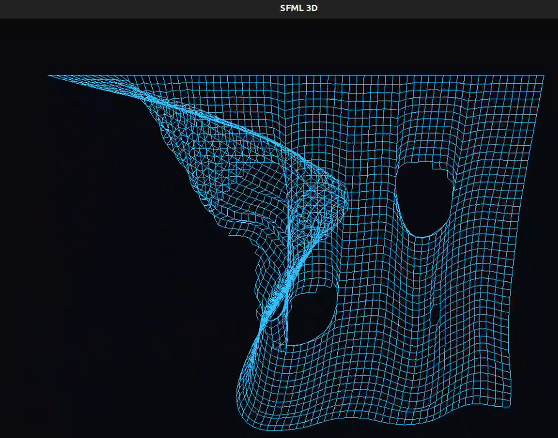

# 3D Cloth Simulation (Verlet Integration)

A real-time physics simulation (taken from [this Linkedin post](https://www.linkedin.com/posts/vahagn-avagyan_verlet-physicssimulation-computationalphysics-ugcPost-7419370389027557376-44Q8?utm_source=social_share_send&utm_medium=member_desktop_web&rcm=ACoAABeeO88B_3YxSoXxELt7_1GUgnkhNOrgtb8)) of cloth, written in C++ using the **SFML** library. The project implements a "Mass-Spring" model managed via [Verlet integration](https://en.wikipedia.org/wiki/Verlet_integration#Basic_St%C3%B8rmer%E2%80%93Verlet) to efficiently calculate positions and velocities.



The code does not use explicit velocity. Instead, it stores the **current position** and the **previous position**.
1.  **Verlet Integration:** The new position is calculated based on the difference between the current and previous one (inertia).
2.  **Constraint Solving:** "Links" (springs) force points to maintain a fixed distance. If they move too far apart, they are pulled back; if they stretch excessively (5x), the link snaps.

###### Configuration Constants

### Configuration Constants

| Constant | Value | Description |
| :--- | :--- | :--- |
| `WIDTH` | `70` | **Horizontal Resolution**: Defines the number of particles along the X-axis.|
| `HEIGHT` | `45` | **Vertical Resolution**: Defines the number of particles along the Y-axis.|
| `DISTANCE` | `18.0` | **Resting Length**: The default structural distance between connected points.|
| `GRAVITY` | `0.35` | **Vertical Acceleration**: Constant force applied to the Y-axis of every point each frame. Controls the perceived weight and "heaviness" of the fabric. |
| `AIR_FRICTION` | `0.98` | **Damping Factor**: Represents air resistance and energy loss (0.0 to 1.0). Essential for Verlet integration stability; prevents infinite oscillation by reducing velocity slightly each frame. |
| `STRETCH_LIMIT` | `5.0` | **Tearing Threshold**: A multiplier relative to `DISTANCE`. If a link is stretched beyond `DISTANCE * STRETCH_LIMIT`, it is considered broken and removed from the simulation. |

## 🛠️ Building

Before compiling, ensure the SFML development library is installed on your system (usually the `libsfml-dev` package on Debian/Ubuntu-based Linux distributions).

```bash
sudo apt-get install libsfml-dev
```

To compile the project, use a C++ compiler setting the standard to C++17. You must link the `sfml-graphics`, `sfml-window`, and `sfml-system` libraries during the build process.

```bash
g++ main.cpp -o fabric -lsfml-graphics -lsfml-window -lsfml-system -std=c++17
```

## 🚀 Usage

```bash
./fabric
```

#### Controls
| Action | Input | Description |
| :--- | :--- | :--- |
| **Grab** | `Left Click` + Drag | Pull and move parts of the cloth. |
| **Cut** | `Right Click` + Drag | Sever connections between points when hovering over them. |
