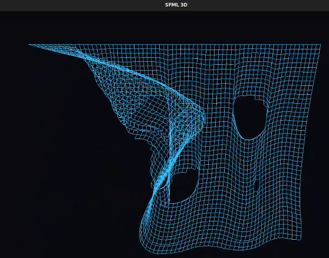

# 3D 布料模拟（Verlet 积分）

## 项目来源

本仓库基于开源项目 **[fabric_sim](https://github.com/MrPiada/fabric_sim)** 演进而来。原始实现为 C++ + SFML 的实时布料物理模拟，灵感可参考原作者引用的 [LinkedIn 帖子](https://www.linkedin.com/posts/vahagn-avagyan_verlet-physicssimulation-computationalphysics-ugcPost-7419370389027557376-44Q8?utm_source=social_share_send&utm_medium=member_desktop_web&rcm=ACoAABeeO88B_3YxSoXxELt7_1GUgnkhNOrgtb8)。

当前版本在保留 Verlet + 质点约束核心思路的前提下，已适配 **SFML 3** API，并增加了 **CMake**、**一键运行脚本** 以及 **小球弹射与房间碰撞** 等扩展功能。

## 扩展功能开发说明

本仓库在上游基础上的所有扩展能力（包括 SFML 3 适配、CMake/`run.sh`、文档补充，以及“小球弹射、打洞、墙壁回弹、落地停留”等功能）均由 **Cursor 的 AI 功能** 参与开发与实现。



## 原理简述

代码不显式存储速度，而是保存 **当前位置** 与 **上一帧位置**。

1. **Verlet 积分**：新位置由当前位置与上一帧位置的差（惯性）推导。
2. **约束求解**：`Link`（弹簧）约束相邻质点保持目标距离；拉得过远会被拉回；拉伸超过阈值（约 5 倍）则连接断裂。

## 配置常量

| 常量 | 取值 | 说明 |
| :--- | :--- | :--- |
| `WIDTH` | `70` | 水平方向质点数量 |
| `HEIGHT` | `45` | 垂直方向质点数量 |
| `DISTANCE` | `18.0` | 相邻质点默认结构间距 |
| `GRAVITY` | `0.35` | 每帧施加在 Y 轴的重力，影响布料“重量感” |
| `AIR_FRICTION` | `0.98` | 空气阻尼（0～1），用于稳定 Verlet、抑制振荡 |
| `STRETCH_LIMIT` | `5.0` | 撕裂阈值：相对 `DISTANCE` 的倍数，超过则断开该连接 |

## 小球弹射（本仓库扩展）

在原始“抓取布料 / 右键切割”之外，增加了 **弹射小球** 与 **简单房间边界**：

- **发射**：按住鼠标 **中键**，向后拖动蓄力，**松开中键**发射；拖动越远，初速度越大（有上限）。
- **布料交互**：小球飞行中与布料线段发生碰撞时，会在命中点附近 **打出洞口**（批量断开连接）。
- **墙壁与地面**：小球在左右墙、前后墙会 **反弹**；落到地面会弹跳并因摩擦逐渐 **静止在地面**，不会无故消失。

小球相关参数可在 `main.cpp` 中调节，例如 `BALL_RADIUS`、`HOLE_RADIUS`、各类反弹与摩擦系数等。更完整的说明见项目内文档 [`PROJECT_OVERVIEW.md`](./PROJECT_OVERVIEW.md)。

## 构建与运行

### 依赖

- C++17 编译器
- **SFML 3**（Graphics、Window、System）
- **CMake**（推荐）
- macOS 可用 Homebrew：`brew install sfml cmake`

### 方式一：CMake（推荐）

```bash
cmake -S . -B build
cmake --build build -j
./build/fabric
```

### 方式二：一键脚本

```bash
chmod +x run.sh   # 仅需首次
./run.sh
```

### 方式三：命令行直接编译（示例）

Linux（Debian/Ubuntu 等）若使用包管理器安装 SFML 开发包：

```bash
sudo apt-get install libsfml-dev
g++ main.cpp -o fabric -lsfml-graphics -lsfml-window -lsfml-system -std=c++17
./fabric
```

> **说明**：上游仓库针对较老的 SFML 2 风格 API 编写；本仓库已迁移到 SFML 3，若使用 SFML 2 需回退对应 API 或改用 SFML 2 工具链。

## 操作说明

| 操作 | 输入 | 说明 |
| :--- | :--- | :--- |
| 抓取布料 | 左键 + 拖拽 | 拖动布料上的质点 |
| 切割 | 右键 + 拖拽 | 鼠标轨迹与线段相交处断开连接 |
| 弹射小球 | 中键按住后拉、松开 | 蓄力发射，击中布料打出洞口；小球会在墙与地面反弹并最终停在地面 |
| 退出 | 关闭窗口 | 结束程序 |

## 相关链接

- 上游仓库：<https://github.com/MrPiada/fabric_sim>
- Verlet 积分（维基百科）：<https://en.wikipedia.org/wiki/Verlet_integration#Basic_St%C3%B8rmer%E2%80%93Verlet>
